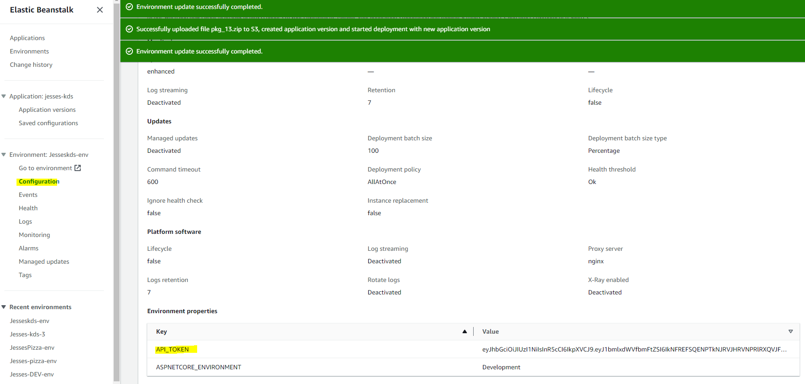

The KDS mobile app that was built using a variety of Telerik controls quit working just before super-bowl weekend Feb 2023. I made a substitute web application that they have been using since. Because the app was made in haste, it has some bandaid like features. 

To deploy

```
dotnet publish
cd bin/Debug/net6.0/publish
zip -r ../../../../pkg_XX.zip .
```

"XX" is a number that I use to distingish one package from the others I may have lying around, any value is fine there. you can use whatever filename for the zip file.

The thing that matters is once you deploy it to the Elastic Beanstalk environment, give it a version number enables it to stand out. 

Also it requires an environment variable API_TOKEN. 

This is an auth token from https://services.jessespizza.com:5000 

It will last 6 months 

To get a new one 

```
curl -X POST "https://services.jessespizza.com:5000/api/Auth/UserLogin" \
  -d "{\"email\":\"your_user_name\",\"password\":\"your_password\",\"deviceId\":\"string\"}"

# use any account that is valid to log in to the jesse's mobile app and the token will work
# then you copy that token into the elastic beanstalk configuration 
```
you can confirm that your token has updated by 
http://your-envurl.com/secret vals

ex:
http://jesseskds-env.eba-xc6gtpni.us-west-2.elasticbeanstalk.com/secretvals


